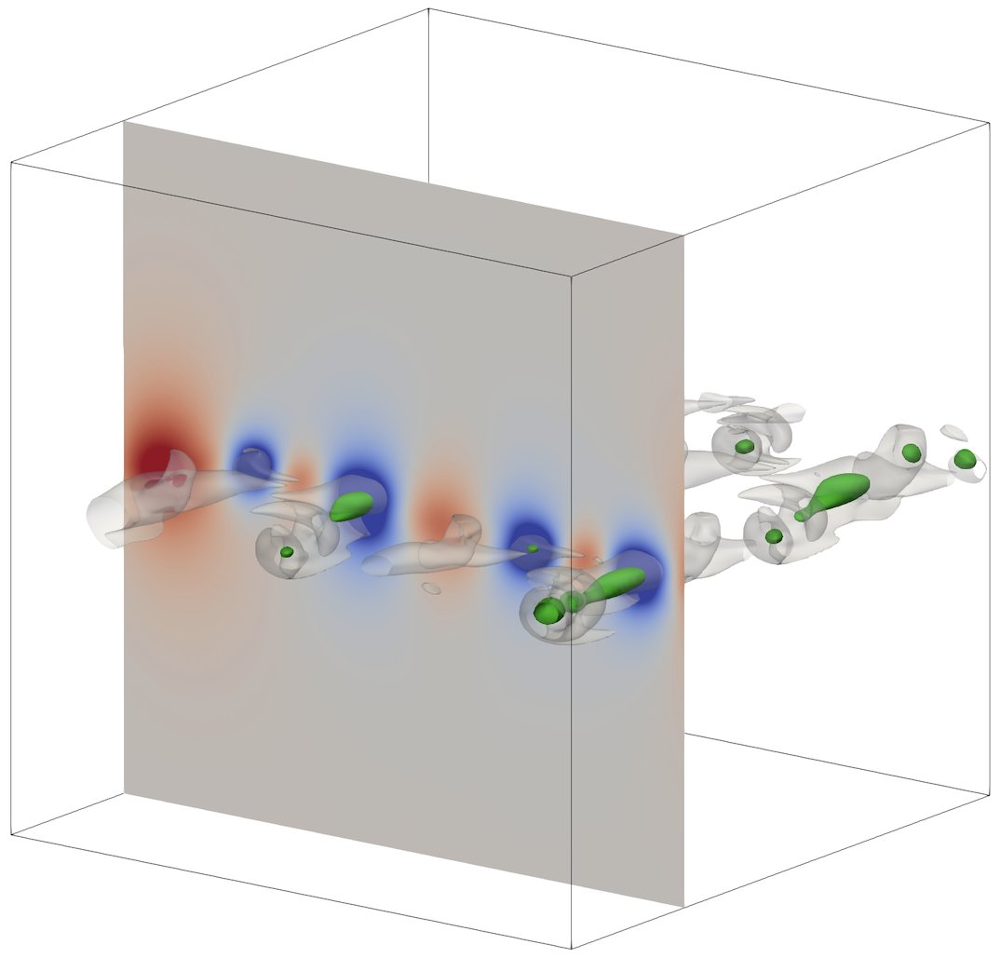
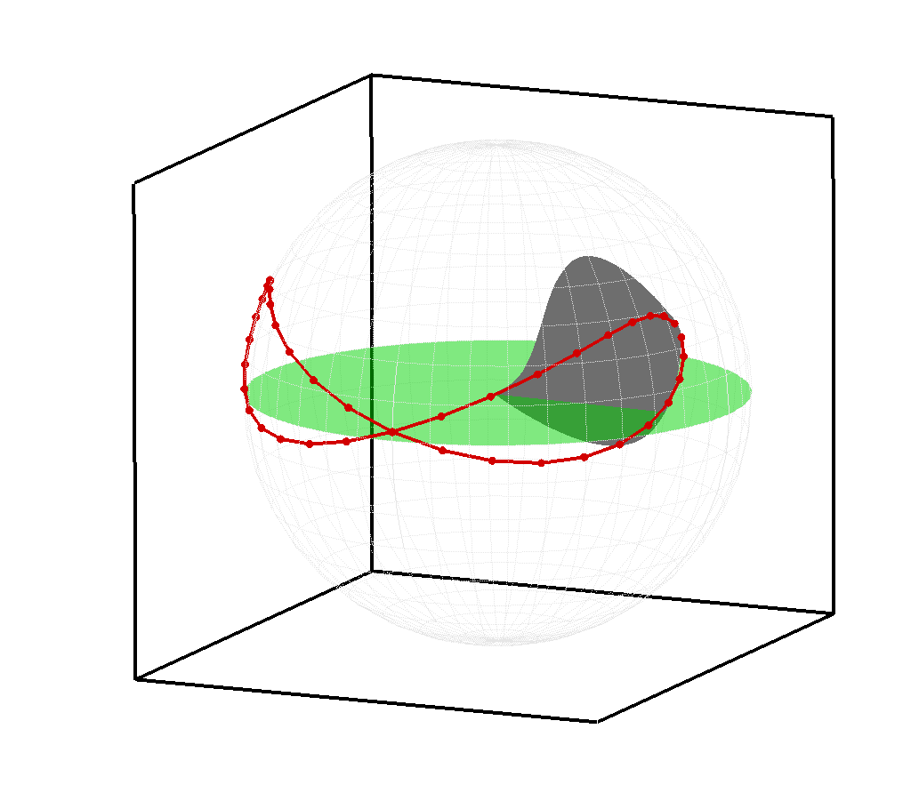
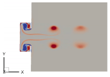

I am a Ph.D. candidate advised by Prof. Tim Colonius at the [Computational and Data-Driven Fluid Dynamics Lab](https://colonius.caltech.edu). My current research interest lies in computational fluid dynamics, multiphase flows, cavitation and high performance computing. Previously, I worked on various topics in fluid dynamics including flapping wing aerodynamics, machine-learning-based aerodynmic modeling and optimization and ship hydrodynamics.

* * *

## Education

Ph.D Candidate in [Mechanical Engineering](https://mce.caltech.edu) @[California Institute of Technology](https://www.caltech.edu) 

M.S. in [Mechanical Engineering](https://me.snu.ac.kr) @[Seoul National University](https://www.snu.ac.kr)

B.S. in [Naval Architecture and Ocean Engineering](https://naoe.snu.ac.kr) @[Seoul National University](https://www.snu.ac.kr) 
_Summa Cum Laude_

* * *

## Research Experience

[Computational and Data-Driven Fluid Dynamics Lab](https://colonius.caltech.edu)  
[California Institute of Technology](https://www.caltech.edu) 
Advisor: Prof. Tim Colonius  

    

        
    

    

        <u>Hyeoksu Lee</u>, Spencer Bryngelson and Tim Colonius, "Cavitation inception in a turbulent mixing layer," <em>2023 American Physical Society Division of Fluid Dynamics</em>, Washington DC, USA, November 19-21, 2023
    

 

[Turbulence, Flow Control & CFD Lab](https://tfc.snu.ac.kr) 
[Seoul National University](https://www.snu.ac.kr) 
Advisor: Prof. Haecheon Choi 

    

        
    

    

        <u>Hyeoksu Lee</u>, Sehyung Oh and Haecheon Choi, "Machine-learning based optimization of the wing kinematics and geometry of a hovering flapping flight," <em>2021 Korean Society of Mechanical Engineers Annual Conference</em>, Gwangju, Korea, November 3-6, 2021  
        <u>Hyeoksu Lee</u>, Sehyung Oh and Haecheon Choi, "Machine-learning based prediction of aerodynamic performance of a flapping wing in hover," <em>2020 Korean Society of Mechanical Engineers Annual Conference</em>, Online, December 16-18, 2020
    

 

[Seoul National University Towing Tank Lab](https://snutt.snu.ac.kr) 
[Seoul National University](https://www.snu.ac.kr) 
Advisor: Prof. Shin Hyung Rhee 

    

        
    

    

        <u>Hyeoksu Lee</u>, Jinkwan Jang, Woochan Seok, Hong Gu Yeo and Shin Hyung Rhee, "Design and analysis of the synthetic jet thruster applying the propulsion of jellyfish," <em>Journal of Computational Fluids Engineering</em>, Vol. 25, pp. 112-119, 2020
    

* * *

## Honors and Awards

* **Allan Acosta Endowed Graduate Fellowship** 
_California Institute of Technology_, 2022

* **KISTI Supercomputing Award** 
_Korean Society for Computational Fluids Engineering_, 2021

* **Certificate of Commendation** 
_Korea Maritime Transportation Safety Authority_, 2020

* **Excellence Award** in EDISON CFD Software Challenge 
_Korea Institute of Science and Technology Information_, 2019

* **National Scholarship for Science and Engineering** 
_Korea Student Aid Foundation_, Spring 2016 - Fall 2019

* **Eminence Scholarship** 
_Seoul National University_, Fall 2014 - Fall 2015